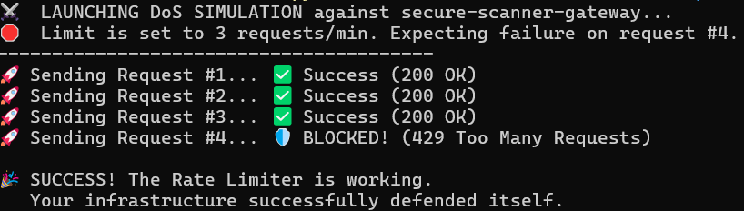
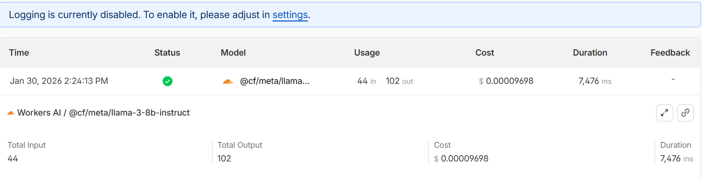

# 🛡️ Secure AI Gateway (DevSecOps Implementation)

**A NIST-compliant AI proxy implementing the CIA Triad (Confidentiality, Integrity, Availability) for LLM traffic.**

## 📌 Project Overview
Direct API access to Large Language Models (LLMs) creates risks of data leakage, unmanaged costs, and Denial of Service (DoS) attacks. This project bridges that gap by establishing a **Security Gateway** using Cloudflare, ensuring all AI traffic is authenticated, monitored, and sanitized before reaching the model.

**Architecture:** `User` ➡️ `Cloudflare AI Gateway (The Shield)` ➡️ `Meta Llama-3 (The Model)`

## 🔐 Security Controls (The CIA Triad)
I engineered this pipeline to satisfy core information security principles:

| Principle | Risk | Solution Implemented | Status |
| :--- | :--- | :--- | :--- |
| **Confidentiality** | PII/Secret Leakage | **Payload Redaction:** Configured the gateway to process requests but *never* store prompt text (logs show `[Redacted]`). | ✅ Active |
| **Integrity** | Unauthorized Access | **Strict Auth:** Replaced direct model access with Gateway-enforced API Token authentication. | ✅ Active |
| **Availability** | DoS / Cost Spikes | **Rate Limiting:** Enforced a policy of **3 requests/min** to automatically block abusive traffic spikes. | ✅ Active |
| **Observability** | Shadow AI | **NIST "Measure":** Centralized logging of token usage, latency, and error rates without compromising privacy. | ✅ Active |

## 🛠️ Tech Stack
* **Infrastructure:** Cloudflare AI Gateway
* **Model:** Meta Llama-3-8b-Instruct (via Workers AI)
* **Language:** Python 3.10+
* **Testing:** Custom Python scripts for connectivity, DoS simulation, and privacy validation.

## 📸 Proof of Concept
### 1. Availability Defense (DoS Attack)
*Simulation of a high-frequency attack. The Gateway detected the spike and enforced the 3 req/min limit, returning `HTTP 429`.*


### 2. Confidentiality (Log Redaction)
*Evidence of "Zero Retention" policy. The system processes the request for metrics (cost/tokens) but disables payload logging to protect user secrets.*


### 3. Observability Dashboard
*Full visibility into API traffic, errors, and costs.*


## ⚡ How to Run
1. **Clone the repository:**
   ```bash
   git clone [https://github.com/YOUR_USERNAME/secure-ai-gateway-nist.git](https://github.com/YOUR_USERNAME/secure-ai-gateway-nist.git)
   cd secure-ai-gateway-nist

2. **Install dependencies:**
   ```bash
   pip install -r requirements.txt

3. **Configure Secrets:**
   Open the scripts in src/ and replace GLOBAL_KEY and ACCOUNT_ID with your Cloudflare credentials.

4. **Run the Security Tests:**
   Test Connectivity: python src/1_connectivity_test.py
   Simulate DoS Attack: python src/2_availability_attack.py
   Verify Privacy: python src/3_confidentiality_test.py

🔮 Future Roadmap:
   Implement Custom Firewall Rules to block prompt injection attacks (e.g., "Ignore previous instructions").
   Set up Email Alerts for security anomalies.
   Integrate with GitHub Actions for automated security testing.
